<!-- TOC -->

- [Yanshee v1.5.1 软件功能介绍](#yanshee-v151-软件功能介绍)
    - [ROS架构的引入](#ros架构的引入)
        - [什么是ROS?](#什么是ros)
        - [目的](#目的)
    - [开放更加丰富的API接口](#开放更加丰富的api接口)
    - [优化PC版 Blockly程序（图形化编程）](#优化pc版-blockly程序图形化编程)
- [升级操作指南](#升级操作指南)
    - [通用OTA升级方法](#通用ota升级方法)
    - [此版本OTA升级方法](#此版本ota升级方法)
        - [OTA升级](#ota升级)
        - [手动升级](#手动升级)
- [如何远程连接机器人桌面](#如何远程连接机器人桌面)
    - [具体步骤](#具体步骤)

<!-- /TOC -->

# Yanshee v1.5.1 软件功能介绍
Yanshee机器人做为一款开源人形教育机器人，我们硬件采用了Raspberry Pi Model 3B，软件采用了基于Raspbian的高度定制系统。基于开源ROS框架的机器人管理套件，也最大限度地提供了教学的灵活性及平台的开放性。

当前的软件功能架构图如下：
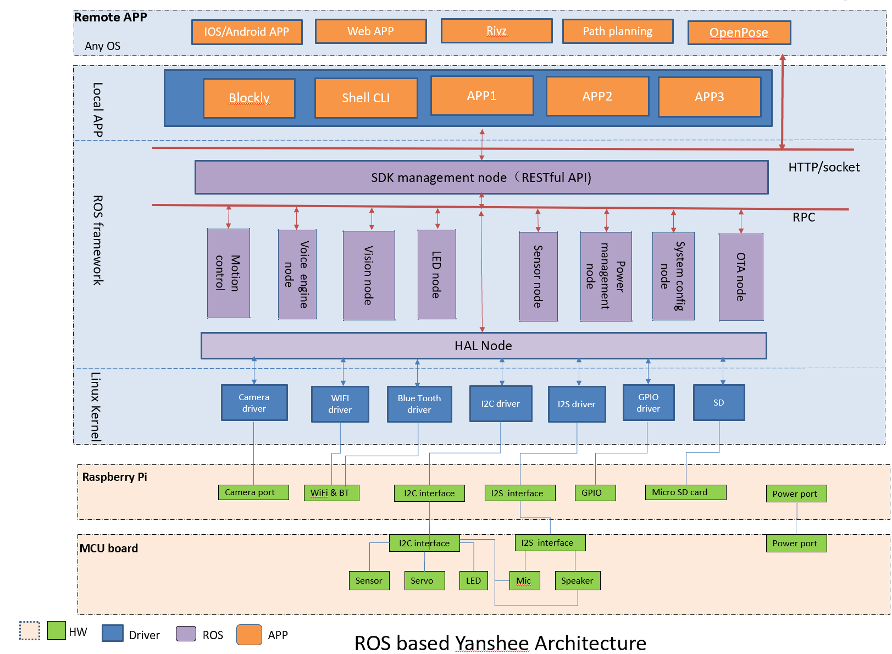

## ROS架构的引入
做为一款供研究和学习型的机器人，怎能没有ROS？ 以下内容摘自 [ROS 官网](http://wiki.ros.org/cn/ROS/Introduction)

### 什么是ROS?
ROS 是一个适用于机器人的开源的元操作系统。它提供了操作系统应有的服务，包括硬件抽象，底层设备控制，常用函数的实现，进程间消息传递，以及包管理。它也提供用于获取、编译、编写、和跨计算机运行代码所需的工具和库函数。

ROS 运行时的“蓝图”是一种基于ROS通信基础结构的松耦合点对点进程网络。ROS实现了几种不同的通信方式，包括基于同步RPC样式通信的服务（services）机制，基于异步流媒体数据的话题（topics）机制以及用于数据存储的参数服务器（Parameter Server）。


### 目的

**ROS 的主要目标是为机器人研究和开发提供代码复用的支持.**

ROS是一个分布式的进程（也就是节点）框架，这些进程被封装在易于被分享和发布的程序包和功能包集中。ROS也支持一种类似于代码储存库的联合系统，这个系统也可以实现工程的协作及发布。这个设计可以使一个工程的开发和实现从文件系统到用户接口完全独立决策（不受ROS限制）。同时，所有的工程都可以被ROS的基础工具整合在一起。

为了支持分享和协作的主要目的，ROS框架也有其它几个目标：

- 小型化：ROS尽可能设计的很小 
  - 我们不封装您的 main() 函数 
  - 所以为ROS编写的代码可以轻松的在其它机器人软件平台上使用。 
- ROS不敏感库：ROS的首选开发模型都是用不依赖ROS的干净的库函数编写而成。
- 语言独立：ROS框架可以简单地使用任何的现代编程语言实现。
- 方便测试：ROS内建一个了叫做rostest的单元/集成测试框架，可以轻松安装或卸载测试模块。
- 可扩展：ROS可以适用于大型运行时系统和大型开发进程。

## 开放更加丰富的API接口

新的ROS系统中提供的API包含了如下新特性:
 - API支持不同操作系统的调用；
 - 开放了更多编程接口，包含了机器8大功能；
 - 提供了内置的GUI文档，可以直接通过浏览器打开。方便用户使用及学习；

在每台机器人上，可以通过在浏览器上输入 http://127.0.0.1:9090/v1/ui 来获得本地的RESTful API,  也可以通过获得机器人的IP地址从远程连接上 http://机器人IP:9090/v1/ui.

同时还可以访问在线文档 [Yanshee RESTful API](https://app.swaggerhub.com/apis-docs/UBTEDU/apollo/1.0.0) 来学习已经支持到的API。

Exmaples here:
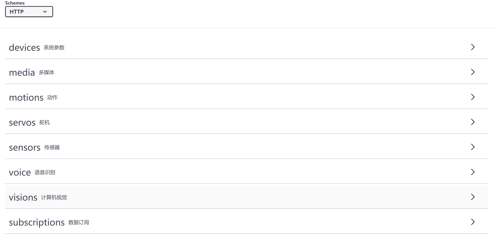
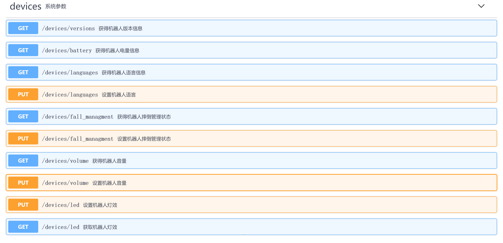


如果想获得更多的细节，请到机器人上进行操作和实践。

## 优化PC版 Blockly程序（图形化编程）

- 删除了 “在20秒内识别人脸”和“识别表情”等2个Blockly 块。加载pc-blockly1.0 v1.4.x项目，此块会变为不可用状态
- 删除菜单 “连接机器人选项”
- “在N秒内识别到X’模块钟 ，去除了N秒功能，改为”识别到X"。（去除时间，将块改为单次任务）
- "舵机模式块" 新增根据舵机ID限定舵机输入范围功能。
- 语音播放任务新增停止功能。
- 人脸采集页面的图像显示由原来的回显方式改为播放视频流方式，并在人脸采集页面新增页面拖拽功能。
- App右侧代码区去除功能性定义代码
- 事件、运动、展示、感知、AI类的block块新增同步阻塞功能
- 视觉任务新增5秒超时功能 
- 新增python进程队列功能

# 升级操作指南
因为引入ROS系统，需要重新安装新的操作系统并调整SD卡的分区。所以升级将会比平时的OTA花费更多的时间，大约需要1个小时左右。

> 同时请注意，升级到新的v1.5.1版本时，系统会重新安装。用户需要先保存数据，升级后数据会因为重装系统被清空。

## 通用OTA升级方法
机器人开机并连上网后，大约1分钟，会主动推送当前有新版本可升级，按胸前按钮，
“叮”一声后对机器人说“升级软件”或者“升级”，机器人会提示用户保存数据，当用户再次说“确认”时，
会给出类似语音提示“正在下载升级文件...”，表示开始升级。

## 此版本OTA升级方法
因为SD分区的变化，从其它版本升级到此版本需要经过两次OTA升级操作。

### OTA升级
确保当前版本大于v1.3.1-2，否则只能使用 [手动升级](#手动升级)：
>输入如下命令检查版本信息：``` dpkg -l | grep ubt```

#### 使用两次[通用OTA升级方法](#通用OTA升级方法)
- 第一次OTA升级从其它版本升级到 v1.3.5
- 第二次OTA升级则从v1.3.5到v1.5.1

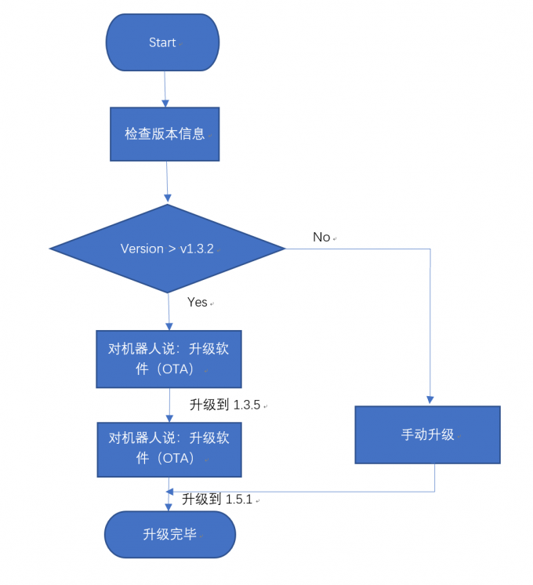

### 手动升级

#### 下载最新的软件

[uPi OS](https://github.com/UBTEDU/Yanshee-Release/blob/master/Noobs/)

#### 如何插拔SD方法

1. 先将机器人关机断电，用螺丝刀将机器人两边“肩膀”的4颗螺丝拧出，将机器人“肩膀”取出放好；

 

2. 用螺丝刀将机器人正面“胸前”的4颗螺丝拧出，缓慢轻轻往上抬“胸前盖”可查看到内置的树莓派主板。
> 注意：往上抬“胸前盖”时别太用力以免弄断关联的连接线；


 

 
3. 用螺丝刀将树莓派主板上固定的4颗螺丝拧出，缓慢往上抬树莓派主板将SD卡取出即可。
> 注意：往上抬树莓派主板时同样需要小心翼翼，抬起角度别太大以免弄断关联的连接线；


 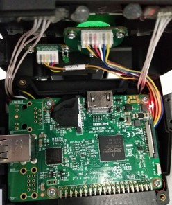
 
 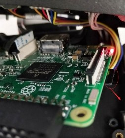

 
1. SD卡使用完毕后需要按之前反过来的步骤装回-》用螺丝固定树莓派主板-》机器人“胸前盖”->机器人“肩膀”方可继续启动机器人使用。
> 注意：重新装回固定过程中同样需要注意别压到或弄断主板关联的连接线；

#### 如何烧录image
1. 准备好SD卡并放到读卡器里，连接PC端USB口，并安装软件SD Card Formatter，将SD卡格式化为fat32格式。（直接点击format默认格式化为fat32格式)。

2. 拷贝下载下来的系统文件NOOBS_UBTEDU_LATEST文件夹内所有内容到SD卡根目录中等待拷贝完成，然后正常退出USB设备。

  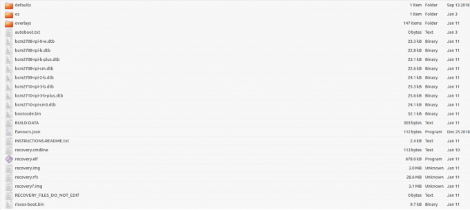

3. 将SD卡安装回机器人SD卡槽中并用螺丝固定树莓派，连接HDMI线后上电。等待大概15分钟左右后系统会自动重启进入到rasbian系统桌面，代表系统正确安装。
 

   

4. 在树莓派系统输入命令```dpkg -l | grep ubt```可查看当前软件版本号是否与升级的一致即可；

>pi@raspberrypi:~ $ dpkg -l | grep ubt
>ii  ubt-yanshee-ros-linux                     1.5.1-14                          armhf        Yanshee ROS

以上升级过程均需要保持适配器连接及保持机器人网络连接

# 如何远程连接机器人桌面

Yanshee可以通过vnc连接共享桌面。但是由于安全原因，vnc默认是关闭的。用户可以通过命令打开vnc远程连接功能。


## 具体步骤

1. 安装ssh远程登录工具 
    ### windows

    1. 安装工具
    
        windows上远程登录工具有很多种。请下载开源且免费的 [putty](https://the.earth.li/~sgtatham/putty/latest/w32/putty-0.71-installer.msi) 后安装。
        
    2. 启动putty
   
        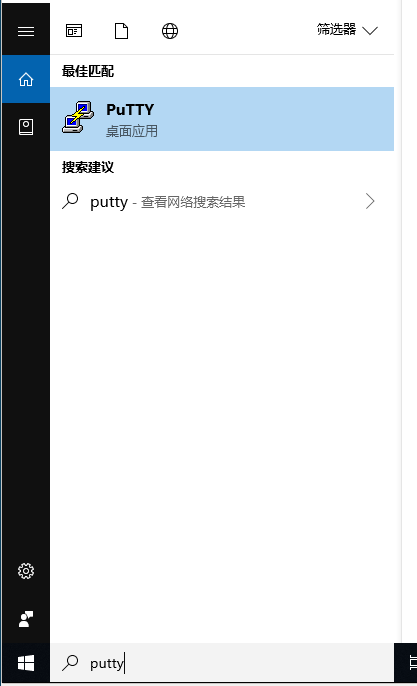
    
    3. 配置putty
        
        配置putty之前需要知道机器人ip地址。如果不知道机器人的ip地址，请连接Yanshee APP。

        请根据如下步骤从Yanshee APPs上得到IP地址

        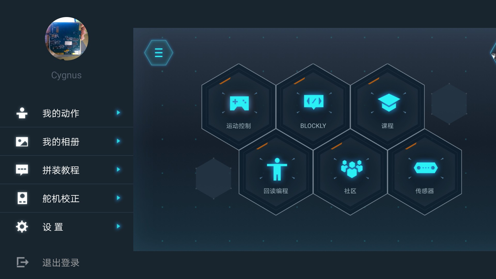

        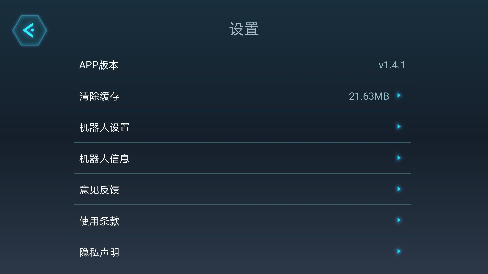
        
        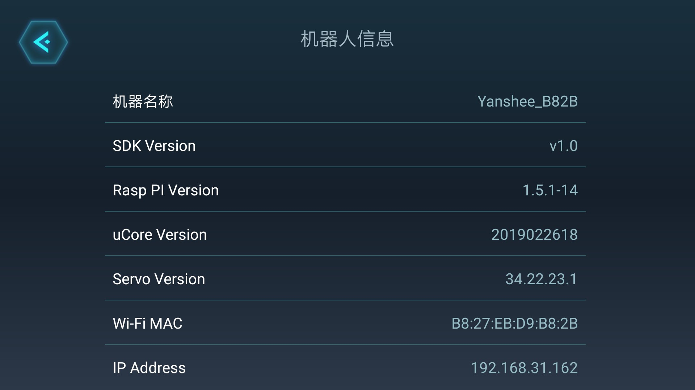

        配置IP地址到putty， 确认后就开始登录。

        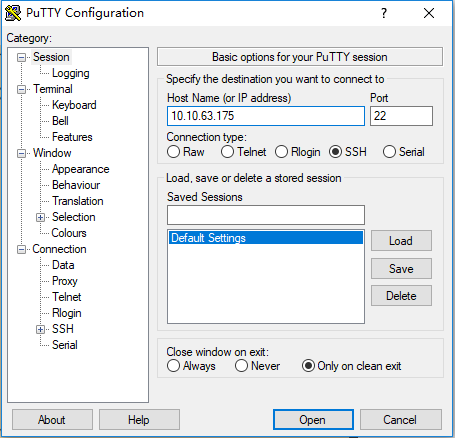

        登录Yanshee的时候请用如下用户名和密码：

        | 用户名 | 密码 |
        | --- | --- |
        | pi | raspberry |

        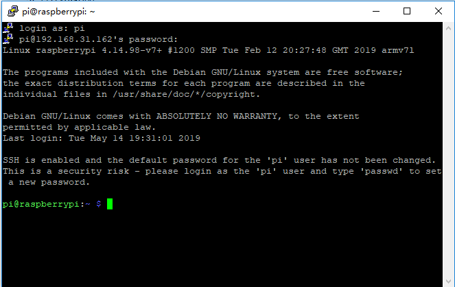

    ### Linux / Mac OSX

    如果使用Linux或者是Mac OSX. 可以直接打开Terminator, 输入如下命令就可以登录了。

    ```
    $ ssh pi@10.10.63.175
    The authenticity of host '10.10.63.175 (10.10.63.175)' can't be established.
    ECDSA key fingerprint is SHA256:8461TLzWhnqN6VIA3KfnhcEMRWk6mx+aJxWl5yhgIgY.
    Are you sure you want to continue connecting (yes/no)? 
    pi@10.10.63.175's password: 
    Linux raspberrypi 4.14.79-v7+ #1159 SMP Sun Nov 4 17:50:20 GMT 2018 armv7l

    The programs included with the Debian GNU/Linux system are free software;
    the exact distribution terms for each program are described in the
    individual files in /usr/share/doc/*/copyright.

    Debian GNU/Linux comes with ABSOLUTELY NO WARRANTY, to the extent
    permitted by applicable law.
    Last login: Tue May 14 18:36:32 2019 from 10.10.19.52

    SSH is enabled and the default password for the 'pi' user has not been changed.
    This is a security risk - please login as the 'pi' user and type 'passwd' to set a new password.

    pi@raspberrypi:~ $ 
    ```

2. 登录Yanshee后, 打开raspi-config

```
pi@raspberrypi:~ $ sudo raspi-config 
```

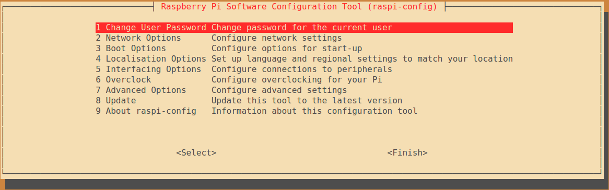

3. 选择Interfacing Options

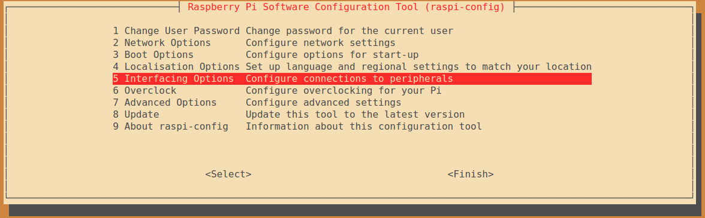

4. 选择vnc

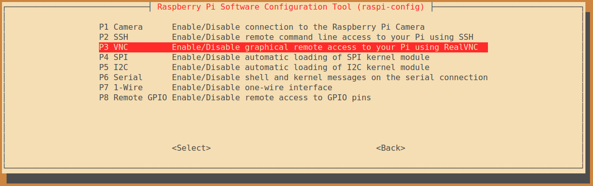

5. 打开vnc功能

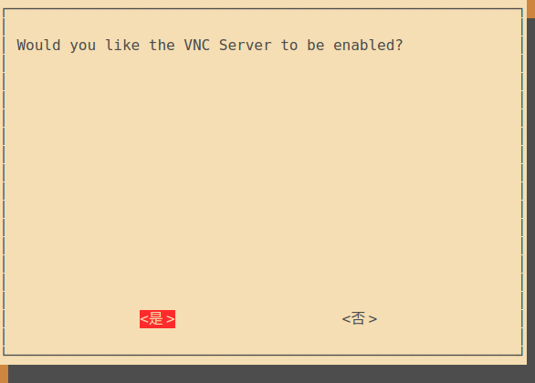

6. 配置完成

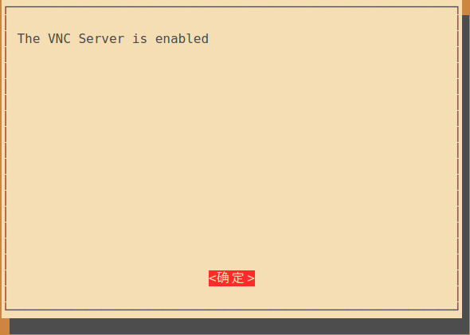